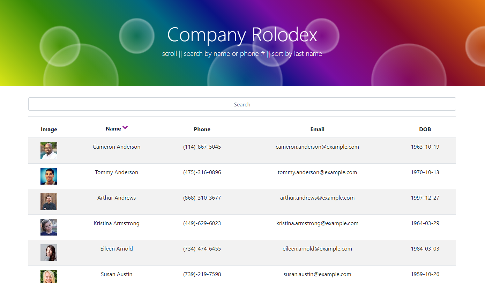

# Company Rolodex
  
  

  An employee directory app built with React

  ## Table of Contents
  * [**Description**](#description)
  * [**Installation**](#installation)
  * [**Usage**](#usage)
  * [**Contributing**](#contributing)
  * [**Tests**](#tests)
  * [**Support Team**](#support-team)
  * [**License**](#license)
  * [**Questions**](#questions)

  ## Description
  This repository contains files for an employee database search app. Built with React, this simple app speaks for itself. On page load, an API call is made to fetch the employee data, which returns 200 results. The user can sort alphabetically by last name, or narrow the search by first name, last name, or phone number.

  Deployed at: https://nameless-brook-59912.herokuapp.com/

  Repository: https://github.com/LindseyM20/company-rolodex

  ## Installation
  Commands to run to install dependencies: npm install

  ## Usage
  To use this program as a web application, simply visit the deploy link. To run locally, clone this repo, run 'npm i', and then run with 'npm start'.

  

  ## Contributing
  [Contributor Covenant Code of Conduct](https://www.contributor-covenant.org/version/2/0/code_of_conduct/code_of_conduct.md)

  ## Tests
  See REACT-README

  ## Support Team
  Special thanks to: 
  
  [Amanda Anderson](https://github.com/aanderson120)

  [Brooklynne Audette](https://github.com/B-Audette)

  ## License
  The contents of this repository are protected under the Unlicense

  ## Questions
  Follow me on GitHub at https://github.com/LindseyM20

  Please contact me with any questions or feedback at lindsey.bordner@gmail.com 
